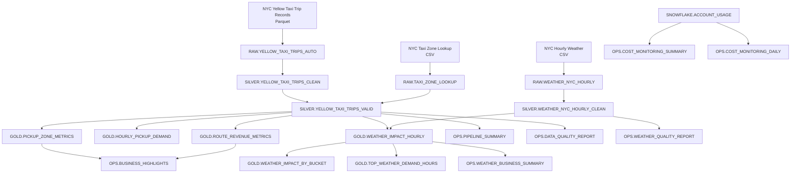

## Architecture

The project follows a medallion-style architecture implemented in Snowflake.



## Overview

The project follows a medallion-style architecture in Snowflake.

```text
RAW     → source-aligned data
SILVER  → cleaned and normalized data
GOLD    → analytics-ready marts
OPS     → operational reporting and monitoring

Data Flow:

NYC Taxi Trip Records Parquet
NYC Taxi Zone Lookup CSV
Open-Meteo Weather CSV
        |
        v
RAW schema
        |
        v
SILVER schema
        |
        v
GOLD schema
        |
        v
OPS schema
```

## RAW layer

The RAW layer stores source-aligned data with minimal transformation.

### Objects:

* RAW.TAXI_ZONE_LOOKUP
* RAW.YELLOW_TAXI_TRIPS_AUTO
* RAW.WEATHER_NYC_HOURLY

## SILVER layer

The SILVER layer applies type conversion, normalization, enrichment, and basic validation.

### Objects:
* SILVER.YELLOW_TAXI_TRIPS_CLEAN
* SILVER.YELLOW_TAXI_TRIPS_VALID
* SILVER.WEATHER_NYC_HOURLY_CLEAN

Important transformation:
TO_TIMESTAMP_NTZ(column_name::NUMBER, 6)

Taxi trip timestamps were loaded from Parquet as epoch microseconds and converted in the SILVER layer.

## GOLD layer

The GOLD layer contains analytics-ready marts:
* GOLD.PICKUP_ZONE_METRICS
* GOLD.HOURLY_PICKUP_DEMAND
* GOLD.ROUTE_REVENUE_METRICS
* GOLD.WEATHER_IMPACT_HOURLY
* GOLD.WEATHER_IMPACT_BY_BUCKET
* GOLD.TOP_WEATHER_DEMAND_HOURS

## OPS layer

The OPS layer contains monitoring and reporting views:
* OPS.PIPELINE_SUMMARY
* OPS.DATA_QUALITY_REPORT
* OPS.BUSINESS_HIGHLIGHTS
* OPS.WEATHER_QUALITY_REPORT
* OPS.WEATHER_BUSINESS_SUMMARY
* OPS.COST_MONITORING_SUMMARY
* OPS.COST_MONITORING_DAILY

## Cost controls

The project uses:
* XSMALL warehouse
* AUTO_SUSPEND = 60
* Manual warehouse suspend after work sessions
* Resource monitor
* Cost monitoring views

