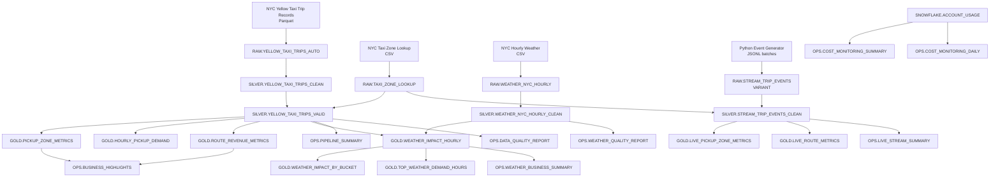

## Architecture

The project follows a medallion-style architecture implemented in Snowflake.



## Overview

The project follows a medallion-style architecture in Snowflake and currently includes two processing paths:

```text
Batch analytics:
NYC Taxi Trips + Taxi Zones + Weather
        |
        v
RAW → SILVER → GOLD → OPS

Streaming simulation prototype:
Python Event Generator → JSONL event batches
        |
        v
RAW VARIANT → SILVER typed events → LIVE GOLD metrics → OPS summary
```

## Batch data flow

```text
NYC Taxi Trip Records Parquet
NYC Taxi Zone Lookup CSV
Open-Meteo Weather CSV
        |
        v
RAW schema
        |
        v
SILVER schema
        |
        v
GOLD schema
        |
        v
OPS schema
```

## Streaming simulation flow

```text
Python simulated event generator
        |
        v
JSONL event batches
        |
        v
RAW.STREAM_TRIP_EVENTS (VARIANT)
        |
        v
SILVER.STREAM_TRIP_EVENTS_CLEAN
        |
        v
GOLD.LIVE_PICKUP_ZONE_METRICS
GOLD.LIVE_ROUTE_METRICS
        |
        v
OPS.LIVE_STREAM_SUMMARY
```
This milestone simulates incremental event ingestion by appending JSONL event batches through Snowflake UI loading. A future milestone will replace manual append with a production-like ingestion mechanism such as staged COPY INTO, Snowpipe Streaming, or Kafka-based integration.

## RAW layer

The RAW layer stores source-aligned data with minimal transformation. JSON event payloads are preserved in VARIANT format.

### Objects:

* RAW.TAXI_ZONE_LOOKUP
* RAW.YELLOW_TAXI_TRIPS_AUTO
* RAW.WEATHER_NYC_HOURLY
* RAW.STREAM_TRIP_EVENTS

## SILVER layer

The SILVER layer applies type conversion, normalization, enrichment, and basic validation.

### Objects:
* SILVER.YELLOW_TAXI_TRIPS_CLEAN
* SILVER.YELLOW_TAXI_TRIPS_VALID
* SILVER.WEATHER_NYC_HOURLY_CLEAN
* SILVER.STREAM_TRIP_EVENTS_CLEAN

### Important transformation:

Taxi trip timestamps were loaded from Parquet as epoch microseconds and converted in the SILVER layer:

```text
TO_TIMESTAMP_NTZ(column_name::NUMBER, 6)
```

Streaming JSON payloads are extracted from VARIANT into typed fields and enriched with taxi zone names.

## GOLD layer

The GOLD layer contains analytics-ready marts:

### Batch analytics marts

* GOLD.PICKUP_ZONE_METRICS
* GOLD.HOURLY_PICKUP_DEMAND
* GOLD.ROUTE_REVENUE_METRICS
* GOLD.WEATHER_IMPACT_HOURLY
* GOLD.WEATHER_IMPACT_BY_BUCKET
* GOLD.TOP_WEATHER_DEMAND_HOURS

### Streaming-oriented live marts

* GOLD.LIVE_PICKUP_ZONE_METRICS
* GOLD.LIVE_ROUTE_METRICS

## OPS layer

The OPS layer contains monitoring and reporting views:

### Batch and quality reporting

* OPS.PIPELINE_SUMMARY
* OPS.DATA_QUALITY_REPORT
* OPS.BUSINESS_HIGHLIGHTS
* OPS.WEATHER_QUALITY_REPORT
* OPS.WEATHER_BUSINESS_SUMMARY

### Streaming reporting

* OPS.LIVE_STREAM_SUMMARY

### Cost reporting

* OPS.COST_MONITORING_SUMMARY
* OPS.COST_MONITORING_DAILY

## Cost controls

The project uses:
* XSMALL warehouse
* AUTO_SUSPEND = 60
* Manual warehouse suspend after work sessions
* Resource monitor
* Cost monitoring views

