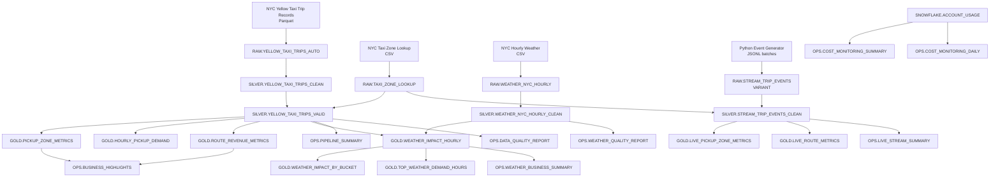

# Snowflake Mobility Analytics

End-to-end data engineering project built on Snowflake using NYC taxi trips, taxi zones, and hourly weather data.

The project demonstrates batch ingestion, RAW/SILVER/GOLD data modeling, data quality checks, business analytics marts, weather enrichment, and cost monitoring.

## Project overview

This project analyzes NYC Yellow Taxi trips for January 2024 and enriches trip data with:
- NYC taxi zone lookup data
- Hourly NYC weather data
- Data quality checks
- Business KPI marts
- Snowflake cost monitoring

## Architecture

The project follows a medallion-style architecture implemented in Snowflake and includes both batch analytics and a streaming simulation prototype.



### Data sources:
* NYC Yellow Taxi Trip Records, January 2024
* NYC Taxi Zone Lookup
* NYC hourly weather data, January 2024

## Snowflake objects

### Compute:
* WH_MOBILITY_DEV

### Database:
* MOBILITY_DEMO

### Schemas:
* RAW
* SILVER
* GOLD
* OPS

### Results:
```text
Metric                      Value
Raw taxi rows               2,964,624
Valid taxi rows             2,863,081
Valid row percentage        96.57%
Weather rows                744
Total taxi revenue          $78,164,735.77
Estimated Snowflake cost    $2.97
Trial budget used           0.74%
```

### Business highlights:
```text
Metric                                       Result
Top pickup zone by demand                    Manhattan / Upper East Side South
Top pickup zone by revenue                   Queens / JFK Airport
Top revenue route                            JFK Airport → Outside of NYC
Top demand hour                              2024-01-17 18:00
Trips during top demand hour                 8,697
Highest average trips/hour weather bucket    freezing
```

### Data quality findings:
```text
Check                           Count
Pickup before January 2024      15
Pickup after January 2024       3
Invalid time order              870
Non-positive distance           60,371
Negative fare                   37,448
Negative total                  35,504
```

### Cost monitoring:
The first batch analytics milestone was completed using an XSMALL Snowflake warehouse.
```text
Metric                              Value
Credits used                        0.9907
Estimated cost                      $2.97
Estimated trial budget used         0.74%
Estimated trial budget remaining    $397.03
```

Cost estimate assumes $3.00 per Snowflake credit. Actual credit price may vary by cloud provider, region, edition, and contract.

## Project status

### Completed milestones:
* Batch ingestion of NYC Yellow Taxi trip records
* Taxi zone enrichment
* Weather data integration
* RAW / SILVER / GOLD / OPS data modeling
* Data quality reporting
* Cost monitoring
* Local Streamlit dashboard based on exported Snowflake data
* Streaming simulation prototype using generated JSONL events
* Live streaming-oriented GOLD metrics and OPS summary

### Current streaming prototype result

```text
Metric                                  Value
Simulated streaming events processed    120
Distinct event IDs                      120
Live event revenue                      $6,496.20
Top live pickup zone by demand          Midtown Center
Top live route by revenue               Upper East Side South → 
                                        Upper East Side North
```

### Next milestones

* Add streaming metrics to the local Streamlit dashboard
* Replace manual JSONL append with stage-based ingestion and load metadata
* Evaluate Snowpipe Streaming or Kafka-based ingestion

## Screenshots

Project screenshots are stored in [`diagrams/screenshots`](diagrams/screenshots).

Recommended review order:

1. Pipeline summary
2. Data quality report
3. Business highlights
4. Top pickup zones
5. Top revenue routes
6. Weather quality report
7. Weather impact by bucket
8. Cost monitoring summary
9. Warehouse suspended status

## Local Streamlit dashboard

The project includes a local Streamlit dashboard based on exported Snowflake sample data.

```bash
python3 -m venv .venv
source .venv/bin/activate
pip install -r requirements.txt
streamlit run app/streamlit_app.py
```

The dashboard can be run without an active Snowflake account because it reads CSV files from:

```text
data/sample/
```

### Run locally

```bash
python3 -m venv .venv
source .venv/bin/activate
pip install -r requirements.txt
streamlit run app/streamlit_app.py
```

### Dashboard sections

- Project summary
- Cost monitoring
- Pickup zone performance
- Top revenue routes
- Weather impact
- Data quality findings


## Streaming simulation prototype

The project includes an initial streaming-oriented prototype based on simulated taxi trip completion events.

### Event flow

```text
Python event generator
        |
        v
JSONL event batches
        |
        v
RAW.STREAM_TRIP_EVENTS (VARIANT)
        |
        v
SILVER.STREAM_TRIP_EVENTS_CLEAN
        |
        v
GOLD.LIVE_PICKUP_ZONE_METRICS / GOLD.LIVE_ROUTE_METRICS
        |
        v
OPS.LIVE_STREAM_SUMMARY
```

### Implemented features

- Python generator for simulated `trip_completed` events
- JSONL event payload format
- Raw JSON storage in Snowflake using `VARIANT`
- Typed SILVER view enriched with taxi zone lookup data
- Live GOLD metrics by pickup zone and route
- Append test using two event batches

### Current prototype result

| Metric | Value |
|---|---:|
| First event batch | 20 events |
| Second event batch | 100 events |
| Total processed streaming events | 120 events |

### Current limitation

This milestone simulates incremental streaming ingestion by appending JSONL event batches through the Snowflake UI. A future milestone will replace manual batch append with a real near-real-time transport such as Snowpipe Streaming or a Kafka-based integration.